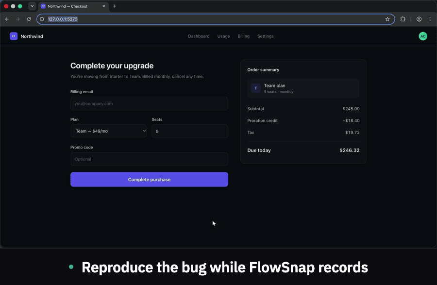
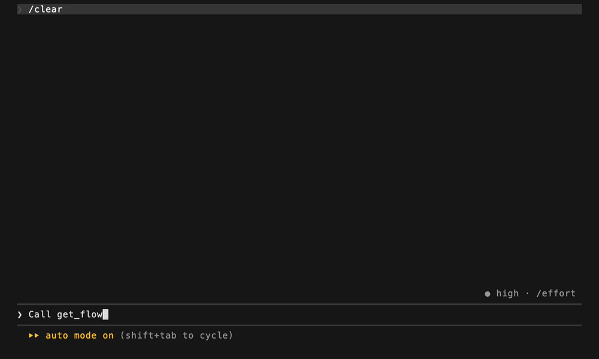

# FlowSnap

**Record a bug in your browser. Hand your AI assistant everything it needs to fix it.**

[](CHANGELOG.md)

[](https://www.npmjs.com/package/flowsnap-mcp)
[](LICENSE)

A Chrome extension (MV3) that records what you do in a browser and exports it as
context an AI coding assistant can actually use: annotated screenshots, the
selectors for every element touched, and the network and console activity each
step produced.

Describing a bug to an assistant loses most of what matters. FlowSnap keeps it.

<p align="center">
  
</p>

---

## How it works

1. **Record.** Press Start in the toolbar popup and use the page as you normally
   would. Every click, keystroke and navigation becomes a step, with a screenshot
   and the console and network activity it produced.
2. **Review.** Steps open in a full tab. Rename the flow, annotate a screenshot,
   redact anything sensitive, drop steps you don't need.
3. **Hand it over.** Export as ZIP, Markdown or JSON — or press **Send** and let
   Claude Code read it directly.

## Install

Not on the Chrome Web Store yet. Load it unpacked:

```sh
git clone https://github.com/ansh-n-chovatiya/Flow-Recorder.git
cd Flow-Recorder
npm install
npm run build
```

Open `chrome://extensions`, turn on **Developer mode**, choose **Load unpacked**
and select the `dist/` directory. Chrome 116 or newer.

Prebuilt ZIPs are attached to each [release](https://github.com/ansh-n-chovatiya/Flow-Recorder/releases)
if you'd rather not build.

## Using it with Claude Code

This is the part the rest of it exists for. One command:

```sh
claude mcp add flowsnap --scope user -- npx -y flowsnap-mcp
```

No clone, no build. `--scope user` registers it for every project you open, in
both the CLI and the VS Code extension.

Record a flow, press **Send**, and paste the prompt it puts on your clipboard.
Claude reads the steps, the console errors, the failed requests and their bodies,
and a screenshot of each step — from inside the project you're trying to fix.

<p align="center">
  
</p>

### What Claude can call

| Tool | Use it for |
| --- | --- |
| `list_flows` | What has been recorded, newest first, each failing flow summed up in a line |
| `get_flow_errors` | Only the steps that broke — the first call when debugging |
| `get_flow_step` | One step in detail, after something else named it |
| `compare_flows` | A run that worked against one that did not |
| `get_flow` | The whole recording as a walkthrough; `raw:true` adds the step data |
| `get_flow_screenshots` | Images inline, when reading files from disk isn't possible |
| `get_latest_flow` | The recording you just made |

Screenshots are written to disk and referenced by absolute path. Claude Code
reads them with its own file tools, one at a time, so a long recording costs
nothing until a specific image is opened.

A long recording comes back a page at a time. Every MCP client caps how much a
tool may return and enforces it by cutting the text, which on a large flow meant
a walkthrough that stopped mid-sentence and a JSON block that never closed —
with nothing to say it had happened. So the server cuts instead, on a step
boundary, and the page says which steps it holds, of how many, and what to call
for the rest:

```
> Steps 1–89 of 120. This is not the whole recording —
  call get_flow({"id":"flow-big","from":90}) for the rest.
```

`FLOWSNAP_MAX_TOKENS` sets the budget if 20,000 is the wrong size for your
client. `get_flow_errors` is bounded the same way, and is still the call to make
first — twelve failing steps out of a hundred and twenty is a few thousand
tokens, against twenty for the recording around them.

### Where flows live

`~/.flowsnap/flows`, one directory per flow:

```
~/.flowsnap/flows/flow-1755000000000/
  flow.json          steps, network calls, console output
  flow.md            readable walkthrough
  meta.json          index entry
  screenshots/       step-01.jpg, step-02.jpg, …
```

Set `FLOWSNAP_DIR` to move them.

### Several Claude sessions at once

The extension POSTs recordings to `127.0.0.1:7734`, and at user scope every
session starts its own copy of the server. Only the first holds the port; the
rest serve from the same directory. Flows arrive once and every session sees
them.

If no session is open, nothing is listening and the send fails. The recording is
still in the extension's library, so pressing Send again later works.

### When Send doesn't reach Claude

Check the server is actually connected before assuming the extension is at fault:

```sh
claude mcp list | grep flowsnap
# flowsnap: npx -y flowsnap-mcp - ✔ Connected
```

`✘ Failed to connect — CONNECTION_CLOSED` usually means the registration points
at a path that has since moved. Re-register against the published package:

```sh
claude mcp remove flowsnap --scope user
claude mcp add flowsnap --scope user -- npx -y flowsnap-mcp
```

The failure is quiet from inside a session — Claude reports that no flowsnap
tools are registered and then tries to find the recording by other means, which
looks like the recording is missing rather than the server being unreachable.

## What gets captured

| | |
| --- | --- |
| **Interactions** | Clicks, text input, `<select>` changes, navigation |
| **Screenshots** | One per step, with the touched element boxed |
| **Selectors** | CSS selector, XPath, ARIA label, role, bounding box |
| **Network** | `fetch` and `XMLHttpRequest` — method, URL, status, response body |
| **Console** | `console.log`, `warn`, `error`, `info`, `debug`, and uncaught errors |
| **React components** | The component each step happened in, and the file it was written in |
| **What changed** | The text of the region around the element, before and after |

Password fields are recorded as bullets, never as text.

Console capture is interception of the `console.*` methods. An uncaught exception
and an unhandled promise rejection are printed by Chrome without passing through
them, so those are captured separately, by their own listeners, and recorded as
errors marked `[uncaught]` or `[unhandled rejection]` with the frames under them.
A crash is the highest-value thing a recording can hold, and it is the one thing
that never reaches `console.error` on its own.

Console and network activity is attached to the **next** step, since that is when
a step is written. Anything the page produces after your last interaction is
collected when you press Stop and written as a final `After the last step` note —
so the failure that happens *because* of the last click, which is the usual shape
of a bug, no longer needs an extra click to be recorded. That step carries no
screenshot: nobody performed it, and a picture of the page as it was left would
read as evidence of an action that never happened.

### React components

On a React page each step also records the component the interaction happened
in, and — where it can — the file that component was written in:

```
3. Clicked "Add to cart"
   ⚛ AddToCartButton · src/components/Cart.tsx:34
```

This works on a minified production build. FlowSnap fingerprints the component
function as the page has it, finds that fingerprint in a script the page already
loaded, and reads that script's source map back to the original file. Nothing is
uploaded and nothing new is fetched from the network where the browser cache can
answer instead — the scripts read are the ones the page itself asked for.

The point is what an assistant does with it: *the click on step 3 was in
`src/components/Cart.tsx`* is the difference between opening one file and
searching a repository.

Where it stops, and what it says instead:

- **Iframes are not covered.** An interaction inside a frame is recorded as a
  step like any other, but no component is attributed to it.
- **A chunk that never loaded cannot be searched.** A lazily-loaded component is
  named but not located until something on the page loads its chunk.
- **Minified names are minified.** On a production build the *name* is whatever
  the minifier left behind. The file path is the real answer; the name is a hint.
- **Ambiguity is reported, not resolved.** When a fingerprint matches more than
  one place in the bundle, the step says so rather than picking one at random.
- **No source map, no original file.** A site that ships none gets the position
  in the compiled bundle, which is at least something to search for.
- **Navigations are not attributed.** There is no element to start the walk from.
- **Shadow roots are covered**, in both directions — React inside a web
  component, and a web component inside React. Iframes still are not.

Every one of those states carries a sentence saying which it is, so a component
with no path never reads as a component with no source file.

Capture and lookup are separate switches in Settings, and setting a **project
root** turns each recorded path into a link that opens the file in your editor.

Whether a flow *carries* what was captured is a third choice, and it lives where
the other recording data lives: **React components & source** is a checkbox in
the export and send dialogs, beside Screenshots, Network calls and Console logs.
It is on by default. Switching it off drops the component ids from the steps and
the source table with them, and touches nothing else in the recording. Switching
capture off in Settings goes further: the flow being recorded forgets the
components it has already collected, rather than ending up attributed for its
first ten steps and not its last ten.

## Exporting

Three formats from the review tab:

- **ZIP** — screenshots plus the full JSON, for attaching anywhere
- **Markdown** — a readable walkthrough, for pasting into an issue or a PR
- **JSON** — the whole flow, for anything that wants to parse it

The annotation editor draws arrows, boxes and text on a screenshot, and its
redact tool blacks out regions permanently before the flow leaves the machine.

## Settings

Open from the popup's gear. Theme, storage usage, delete-all, the MCP server URL
with a **Test connection** button, and the React component controls: whether to
record components at all, whether to look their source files up, and the project
root and editor that make a recorded path clickable.

Most of what FlowSnap decides — the step limit, screenshot quality, how much of
a request body is kept, when a body is summarised rather than stored — is still
hardcoded. [`docs/CONFIGURATION-PLAN.md`](docs/CONFIGURATION-PLAN.md) is the plan
for making those settings, which knobs should never become settings and why, and
how a value reaches a page-world agent and a separate Node process that cannot
read the extension's storage.

**Auto-send is off by default**, and turning it on shows a warning first. It
ships whole flows — screenshots and captured request bodies — to the local server
on every stop, and that should be a decision rather than a default.

## Privacy

Everything stays on your machine. Flows live in `chrome.storage.local`; the MCP
server binds to loopback and writes to your home directory. Nothing is uploaded
anywhere, and there is no telemetry.

Captured **request and response bodies are not redacted** — only headers are. A
recorded flow held in the extension can therefore contain whatever your app
sent, including tokens in payloads. Use the redact tool before sharing a flow,
and be deliberate about auto-send.

What is *sent* is narrower. A flow handed to the MCP server carries each
successful response as an inferred schema rather than its content — field names
and types, not values — so a body that held a token arrives as
`{ access_token: string }`. Failed calls keep their bodies, because on a failed
call the body is the error. Headers are dropped except for five on a call that
failed, where the header can itself be the bug. None of this changes what the
extension stores or what the viewer shows you.

### Permissions, and why each is needed

| Permission | Why |
| --- | --- |
| `activeTab`, `tabs` | Identify the tab being recorded and follow it |
| `scripting` | Inject the recorder into a tab that predates the extension |
| `storage`, `unlimitedStorage` | Keep flows locally; screenshots are large |
| `downloads` | Write the export file you asked for |
| `<all_urls>` | Record on whatever page has the bug, and read that page's own scripts and source maps to find which file a component came from |
| `http://127.0.0.1:7734/*` | Send flows to the local MCP server |

## Development

```sh
npm install
npm run build      # writes dist/
npm run dev        # rebuild on change
npm run verify     # typecheck + lint + token guard + tests + all three builds
npm run package    # a release ZIP in releases/, version-synced from package.json
npm run core:drift # what has changed in the files shared with react-source-locator
```

`npm run verify` is what CI runs. Run it before pushing.

`mcp-server/` is a second npm package with its own lockfile — it is published to
npm on its own, so it is deliberately not a workspace. The root `postinstall`
runs `npm --prefix mcp-server ci` so a plain `npm install` sets up both; the
tests spawn the real server, and skipping that install fails them. If you
installed with `--ignore-scripts`, run that command yourself.

### Layout

```
src/
  background/   MV3 service worker: capture queue, step persistence, badge
  content/      injected into the page: interaction listeners
  injected/     MAIN-world agent: network and console interception
  chrome/       the only place chrome.* is called; every call returns a Result
  core/         pure logic — selectors, describe, schema, export formats
  features/     recording preflight, flow store, export, MCP
  ui/           popup, settings, viewer, and the shared design system
  shared/       types, errors, constants, messages
public/         manifest, icons, fonts, content.css — copied verbatim
scripts/        icon and mark generation, token guard, version sync, packaging
docs/           SHARED-CORE.md — the files shared with react-source-locator
mcp-server/     published to npm as flowsnap-mcp; not part of the extension build
                core.js is src/core/ bundled in by `npm run build:mcp` — generated
```

Six files under `src/core/react/` are shared by copy with the sibling extension
[react-source-locator](https://github.com/ansh-n-chovatiya/react-source-locator).
They are copies rather than a package on purpose, and four of the differences
between the two versions are deliberate — the line base most dangerously, since
getting it wrong opens every file one line off and nothing fails. Read
[`docs/SHARED-CORE.md`](docs/SHARED-CORE.md) before copying anything between the
repos, and run `npm run core:drift` to see what has moved upstream.

Three rules hold the structure together:

- **`chrome.*` is called only from `src/chrome/`.** Everything else receives a
  `Result<T>`, so a failed storage write or a blocked tab is a value to handle
  rather than an exception to miss.
- **`core/` is pure** — no Chrome, no DOM, no clock. That is why most of it is
  testable in Node, and why `npm run build:mcp` can bundle it into the MCP
  server package: the walkthrough Claude reads and the Markdown you download are
  rendered by the same function. The server used to keep a second, smaller copy
  of that renderer, and the two disagreed about which selectors were worth
  printing, when to repeat a URL, and whether page text needed escaping — with
  the careful one rendering the file a human opens and the weak one rendering
  what the model read. `mcp-server/core.js` is generated; `npm run verify`
  builds it before the tests that spawn the server.
- **Views are derived, then rendered.** `derivePopupView`, `deriveLibraryView`,
  `deriveReviewView` and `deriveExportView` decide what a screen shows; the
  controllers only bind the result to markup. Every state a screen can be in is
  a case in one of those functions, and is covered by a test.

### Design

`src/ui/styles/tokens.css` is the only file allowed to name a colour, enforced by
`npm run lint:tokens`. The rationale, the deliberate departures from the original
frames, and the decisions worth knowing before changing a screen are in
[`docs/design/README.md`](docs/design/README.md); the brief they came from is
[`docs/DESIGN-BRIEF.md`](docs/DESIGN-BRIEF.md).

### Architecture notes

[`AUDIT.md`](AUDIT.md) is the audit of the pre-TypeScript build and the migration
plan it produced. It is the reference for what each finding was and where it was
addressed.

## Releases

[`CHANGELOG.md`](CHANGELOG.md) records what changed. Tagging a commit `v2.0.1`
and pushing the tag builds the extension, attaches a loadable zip to a GitHub
release, and publishes `flowsnap-mcp` to npm at the same version.

```sh
npm version patch          # bumps package.json, manifest.json and mcp-server/
git push origin main --follow-tags
```

The tag must match all three version files or the workflow refuses to build — a
server that disagrees with the extension it shipped beside makes "which one do I
have" unanswerable. `npm version` keeps them in step; editing by hand does not.

### Publishing rights

The release workflow authenticates to npm either way, so switching between them
is a change on npmjs.com rather than a change to the workflow:

- **`NPM_TOKEN` repository secret.** Required for the first publish — trusted
  publishing is configured *on* a package, so it cannot create one. A classic
  Automation token, or a granular token with all-packages write; afterwards,
  narrow it to `flowsnap-mcp` alone.
- **Trusted publishing.** Register this repo and `release.yml` as a trusted
  publisher on the package, then delete the secret. The workflow authenticates
  with the `id-token` permission it already has, and no long-lived credential
  exists to leak or rotate.

Either way the tarball carries provenance, which needs the repo and the package
to both stay public.

## Licence

[MIT](LICENSE). IBM Plex is vendored under the SIL Open Font Licence — see
`public/fonts/OFL.txt`.
